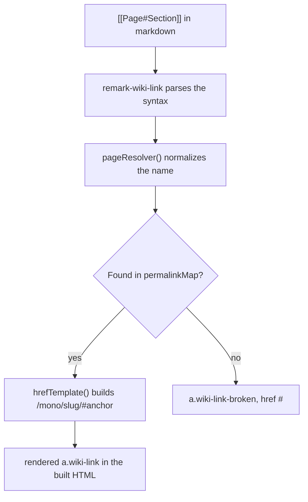
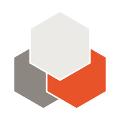

import VersionBadge from '../../components/VersionBadge.astro';
import Flags from '../../components/Flags.astro';
import CostEstimator from '../../components/CostEstimator.astro';

This page is the living reference for documentation conventions in this tree. Each section
below demonstrates one convention end to end — the markup an author writes, and what it
produces — so a future page can copy the pattern instead of inventing a new one. See
[[index|Home]] for the docs' entry point.

## Mermaid diagrams

A fenced ` ```mermaid ` block renders to a real, static SVG at build time — not a code block, and
not a client-side mermaid.js runtime shipped to the browser. The diagram below is true of this
project: it's how a `[[Page#Section]]` wikilink on this very page turns into a working link.



`permalinkMap` is built once, at `astro.config.mjs` load time, by reading every file under
`src/content/docs` off disk (see `wiki-links.mjs`) — before Astro's content-collection pipeline
exists to ask instead.

## Interactive elements

A one-input widget doesn't need a UI framework — plain Astro markup plus a vanilla `<script>` is
enough, and it ships nothing a framework runtime would add. This one estimates the cost of an
agent run from token counts and a rate, styled per `design/DESIGN.md` §6's Input and Stats specs.

<CostEstimator />

## Images

The three-hexagon ADI mark (`design/reference/design-system.html`), saved as a real asset under
`src/assets/` so Astro's image pipeline optimizes it, referenced with ordinary markdown image
syntax:



## Cross-references

### Linking to a page

`[[Page Name]]` resolves against this project's own content collection by title or file slug —
[[index|Home]] links to the docs' index page (`src/content/docs/index.mdx`, titled "ADI Mono
docs") without either side needing to know the other's exact spelling.

### Linking to a section

`[[Page#Section]]` resolves the same way, then appends the section's real heading id — this
links to [[Example#Linking to a section]], the very subsection you're reading, which proves the
anchor actually resolves rather than just parsing.

## Sections

Every one of these seven features gets its own `##` heading; subparts inside a feature (like
"Linking to a page" above) get `###`. This is what feeds the "on this page" nav at right — a
heading hierarchy for its own sake, and a table of contents as a side effect of writing one.

## Version markers <VersionBadge version="1.2" />

A small pill next to a heading or feature marks when it shipped, without implying a status (it
isn't colored or semantic — just `design/DESIGN.md` §6's plain Tag, `.07`-tint fill, `--ink-2`
text). Use it inline in a heading, or anywhere in body text: `<VersionBadge version="1.2" />`.
Because embedding a component means this page is `.mdx`, not `.md`.

## Flags

Exactly three flags exist: **Preview**, **Expert area**, and **Enterprise interest**. A section
can carry zero, one, or several at once. Author them the same way as the version marker — a
small reusable component, `<Flags>Preview</Flags>`, its label a slotted child rather than a
prop — but a flagged heading renders differently in two places at once:

- In the page body, `<Flags>` renders its usual `design/DESIGN.md` §6 pill next to the title.
- In the sidebar "on this page" nav, the same flag shows as a small Lucide icon — one per flag,
  in declaration order, ahead of the entry's title — with the flag's name as its accessible
  label rather than visible text, since there's no room for a pill in the TOC.

Making both true at once takes more than the version marker's trick of relying on Astro's
heading-text extraction: a `remark` plugin (`remark-flags.mjs`) strips a flagged heading's
`<Flags>` children out of its *own* text before Astro ever computes that heading's title or
anchor id from it — otherwise the flag's name would leak into both — and a small
build-time-generated map (`heading-flags-plugin.mjs`, read off this file directly) tells an
overridden `TableOfContents` which icons belong on which entry, since Starlight's real
`headings`/TOC data only ever carries a heading's plain text, nothing structured.

### A preview section <Flags>Preview</Flags>

Use `## Heading <Flags>Preview</Flags>` for a section describing something not yet stable.

### An expert-and-enterprise section <Flags>Expert area</Flags> <Flags>Enterprise interest</Flags>

Two `<Flags>` components, used together, prove the multi-flag case: this heading carries both
"Expert area" and "Enterprise interest" at once, and both icons appear — in that order — next to
this entry in the "on this page" nav, not just as pills once you've scrolled to the section.
