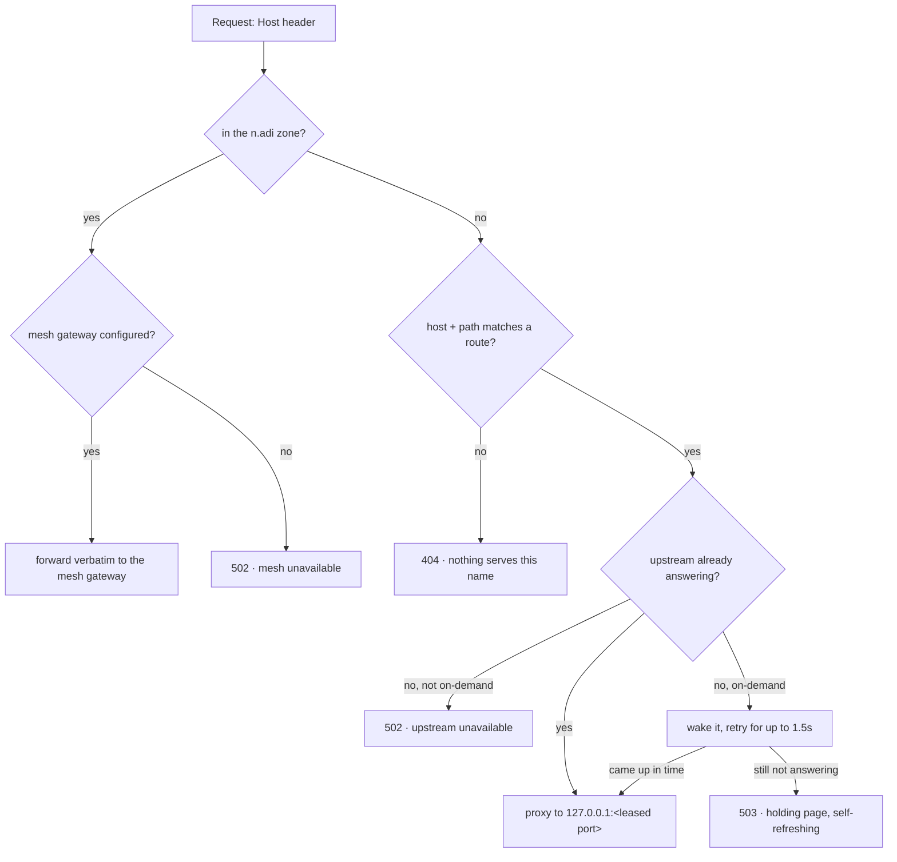

import Flags from '../../components/Flags.astro';

Hive routes every `*.adi` hostname on the machine to a local process, and supervises that
process's whole life: restarting an `always` service that dies, starting an on-demand one on its
first visit, stopping it again once nobody's looking. Declare a host, a port, and a command; hive
does the rest. The crate is `crates/adi-hive`.

Every project dashboard, every dev server, the control panel itself, and this docs site are hive
services. This page is served by one right now — `docs.adi`, port 8030, on-demand.

## What a hive service is

A hive service is a long-running process with a name, optionally a hostname, and a supervisor
watching it. Point hive at a command and it becomes reachable at `<host>.adi`, and — by
default — starts itself the moment someone visits and stops itself after the configured idle
window. An `always` service additionally gets relaunched whenever it dies; see [Restart and
recovery](#restart-and-recovery).

That's a different job from the other two ways to run something in ADI:

- A **trigger** reacts to an event — a webhook, or a background job — and never gets a hostname
  or a proxy in front of it. Reach for hive when something has to *answer* HTTP requests; reach
  for a trigger when something has to *run in response to* one.
- A **backgrounded shell job** (`&`, a detached `bun run dev`) dies with the shell session that
  started it and is not restarted, proxied, or leased a port. `nohup` survives the logout but
  still gets none of that. A hive service survives a reboot if you ask it to, answers at a real
  hostname instead of a bare port, and gets its port from a lease instead of a guess.

If a person is going to type a name into a browser, or something needs a `curl`-able address
that doesn't change between runs, it belongs in hive.

## Declaring a service

Every hive service lives in a `hive.yaml`, and there are exactly three places one can come from:
a project's own `.adi/hive.yaml`, a dashboard's generated frontend/backend pair, or the global
`~/.adi/mono/hive/hive.yaml`. The global config `imports:` every project's file by glob and fans
their services into one routing table, each renamed `<project>/<service>` so two projects can
both have a service called `backend` without colliding.

This is the file behind the page you're reading, `adi-mono/.adi/hive.yaml` in full:

```yaml
services:
  docs:
    proxy:
      host: docs.adi
    rollout:
      recreate:
        ports:
          http: bash`ports-manager.get('adi-mono/docs', 'http')`
    runner:
      script:
        run: bun ./node_modules/.bin/astro dev --port $PORT --host 0.0.0.0 --allowed-hosts
        working_dir: workspaces/main/apps/docs
```

`GET /api/hive` on this machine reports it as `docs.adi` → `127.0.0.1:8030`, on-demand, running.
Its key in the global hive's table is `adi-mono/docs` — the namespacing an import adds.

The fields that matter:

- **`proxy.host`** — the hostname a request has to arrive on. No host, no route — and since
  nothing could ever visit it, such a service defaults to running always rather than on-demand.
- **`proxy.path`** — an optional prefix, for two services sharing one host: a dashboard's
  frontend takes `nosh.adi` outright, its backend claims `path: /api` on the same host. Longest
  prefix wins; a service with no path is the host's fallback; `path: /` means the same thing as
  no path at all.
- **`rollout.recreate.ports`** — a map of named ports. `http` is the key the proxy forwards to;
  if there's no `http` key but exactly one port total, that one is used instead. Should be leased,
  not typed — see [Ports](#ports-leased-never-picked) below.
- **`runner`** — how the service actually runs: `script` or `docker`, below.
- **`environment.static`** — extra environment variables, applied after the injected
  `PORT`/`PORT_<KEY>` vars. Shared by both runner kinds.
- **`restart`** — `always` | `on-failure` (default) | `no`.
- **`start`** — `always` | `on-demand`. Defaults to **on-demand** for any service with a
  `proxy.host`, and to `always` for one without — see [On-demand start and
  idle-stop](#on-demand-start-and-idle-stop).
- **`idle_stop`** — how long an on-demand service may sit unvisited before it's stopped: `1h`,
  `30m`, `90s`, or a bare number of seconds. Default `1h`; meaningless for an `always` service.
- **`stop_grace`** — on-demand only: how long an idle stop waits between `SIGTERM` and `SIGKILL`
  before it escalates. Default `30s`.

A script's `run:` may also reference `{{ runtime.port.http }}` (or any other port key) directly,
for a command that takes its port as a flag rather than reading `$PORT`.

### Runners: script or docker

A service declares exactly one runner kind. Both, or neither, is refused — logged and skipped
rather than guessed at — so a stray second block can't silently shadow the one you meant.

**`runner.script`** runs `run:` through `sh -c`, in `working_dir:` (relative to the `hive.yaml`'s
own directory unless absolute — for a project's `.adi/hive.yaml` imported into the global hive,
that's the project's root, not the importer's). That's the `docs` example above.

**`runner.docker`** runs the service as a container instead, with the familiar compose-ish keys:

```yaml
services:
  search:
    proxy:
      host: search.adi
    rollout:
      recreate:
        ports:
          http: bash`ports-manager.get('proj/search', 'http')`
    runner:
      docker:
        image: meilisearch/meilisearch:v1.10
        ports:
          http: 7700
        volumes:
          - ./data:/meili_data
        environment:
          MEILI_MASTER_KEY: super-secret
        pull: missing
```

`ports:` here maps each of the service's leased **host** port keys to the **container** port it
forwards to — `http: 7700` publishes the leased `http` host port to the container's `7700`, on
`127.0.0.1` only, so the container is reachable from this machine and not the network, the same
guarantee a script listening on `127.0.0.1` gets by convention. `volumes`, `environment`, `pull`
(`always` | `missing` | `never`), `command`, and a raw `args` escape hatch for anything not
modelled first-class round it out.

A container runner **attaches to an existing container rather than recreating one**: `docker
start <name>` if it exists, `docker run -d --name <name> …` to create it if it doesn't, then
`docker wait` it — so what the supervisor actually watches is `docker wait`, not the application
process inside the container. That has two consequences worth knowing: a stop (a supervisor
restart, or an on-demand idle-stop) only ends the `wait`, never the container itself — `docker
stop <name>` is the one thing that does — and the container's own stdout/stderr never reaches
hive's logs; read them with `docker logs <name>`. Create-time flags (ports, volumes, env) apply
only when the container is first created; changing them later needs the container removed —
`docker rm -f <name>` — before the next launch recreates it with the new shape.

## Ports: leased, never picked <Flags>Enterprise interest</Flags>

A `ports:` value can be a literal integer, but the convention — what the panel's own "create
service" flow writes — is a `` bash`ports-manager.get('service', 'key')` `` command instead. It
runs on every read, but the reservation it makes is idempotent, so re-reading the same config
always returns the same already-leased port rather than a new one. Omit the `ports:` block
entirely and the loader leases an `http` port for a proxied or runnable service automatically on
first read; writing the command explicitly, as the `docs` example does, just keeps the lease
visible in the file instead of happening invisibly at runtime.

`GET /api/ports` on this machine shows the live lease table — the 8000–9999 allocatable range,
what it will never touch, and every current lease:

```json
{
  "range": { "start": 8000, "end": 9999 },
  "reserved": [{ "start": 0, "end": 1023 }, { "start": 15000, "end": 15999 }],
  "leases": [
    { "service": "app", "key": "http", "port": 8000 },
    { "service": "adi-mono/docs", "key": "http", "port": 8030 },
    { "service": "adi-hive", "key": "front-door", "port": 8021 }
  ]
}
```

`0–1023` is the privileged band — binding it needs root, so it's never handed out. `15000–15999`
is reserved around ADI DNS's own `127.0.0.1:15353`: that range is never touched by the port
manager, and the DNS service itself is never something this page — or any hive config — should
stop, kill, or restart.

Two services can never be handed the same port, a leased port survives a reload without moving,
and the whole table is one `curl` away rather than scattered across shell history and env files.

## Routing

A request's `Host` header is matched case-insensitively with any `:port` stripped, then the
longest matching path prefix on that host wins — a route with no path is the host's catch-all.
Three different things can happen to a name that doesn't resolve to a live answer, and they are
deliberately three different pages, not one generic error:

- **Nothing claims the host** — an animated `404`. The front door has never heard of the name.
- **Something claims it, but its port refuses the connection** — a `502`. The app exists; its
  process is down.
- **The service is on-demand and this request just woke it** — the front door retries the
  upstream for up to 1.5 seconds first, so a service that comes up quickly serves the real page
  outright; only once that window runs out does the visitor get a self-refreshing `503` holding
  page instead of sitting through the wait.



### The `n.adi` reservation <Flags>Expert area</Flags>

`n.adi` and everything under it is reserved for remote nodes on the fleet mesh —
`<service>.<node>.n.adi`. No local service may claim a host inside that zone; a config that tries
is dropped with a warning rather than routed, so a local project can never shadow a remote
machine's namespace. A request for an `n.adi` host is forwarded verbatim to whatever loopback
address `proxy.mesh_gateway` names, if the machine has one configured, or answered with its own
"mesh unavailable" page — distinct from the plain 404, because the name is valid, this machine
just has no way to reach it. See [[Fleet]] for pairing and grants, and [[Mesh]] for the
peer-to-peer transport.

## On-demand start and idle-stop

A service with a `proxy.host` is **on-demand by default**: nothing is launched at boot, it exists
purely as a route until the first request arrives. That request both starts the process (if it's
down) and stamps the activity clock that keeps it up; a visit is the only thing that ever wakes
it. A service's own startup counts as activity too, so a boot that takes a minute isn't mistaken
for a minute of silence and stopped before it has answered anything.

Once `idle_stop` passes with no request, the service is stopped with a `SIGTERM` — giving it
`stop_grace` to finish what it's doing before a `SIGKILL` — and left **idle-stopped**, not gone:
the next visit starts a fresh process. A request landing inside that grace window cancels the
stop and keeps the same process running, provided it's still answering; one that has already gone
too far to serve is let go and restarted instead, at the cost of one more cold start.

For an on-demand service, **`restart:` is simply not read**: the request is the restart policy —
a process that exits on its own, cleanly or not, is idle-stopped, and the next visitor gets a
fresh one. Setting `restart: always` on an on-demand service changes nothing about it; that field
only governs `always` services, below.

Both windows are configurable per service and both are optional — this excerpt, trimmed from the
crate's own shipped example config, sets both explicitly on an otherwise ordinary service:

```yaml
watch:
  proxy:
    host: watch.adi
  start: on-demand
  idle_stop: 30m
  stop_grace: 10s
```

## Restart and recovery

For an `always` service, `restart:` decides what happens on exit: `always` relaunches whatever
the exit status, `on-failure` (the default) relaunches only a non-zero exit and leaves a clean
one stopped, `no` never relaunches at all. A relaunch backs off — 500ms, doubling up to a 30
second ceiling — and the backoff resets once a run has stayed up for 10 seconds, so a genuinely
unstable process doesn't get hammered but a service that's merely slow to bind its port isn't
punished for it either.

The config — and everything it `imports` — is re-read every 3 seconds. Reconciling diffs each
service's whole resolved spec against what's currently running: a service that's byte-identical
is left completely alone (no restart, no dropped connections); one that's gone is stopped; one
that's new or changed is (re)launched if it's `always`, or simply (re)registered and left idle if
it's on-demand — a config change is not itself a visit. The routing table hot-swaps the same way, so adding
a `proxy.host` to a service starts routing without a front-door restart. Only the **bind**
addresses themselves — the front door's own listening sockets — are fixed at process start;
adding a new one needs a restart of the hive daemon itself.

## Operating it

The panel is `/settings/hive`: every declared service, from every project and the global hive,
with its state (running / idle-stopped / starting), live CPU and memory, a per-row Start/Stop
button, and a "Reload config" button that forces an immediate re-read instead of waiting for the
next tick.

The API: `GET /api/hive` lists every service with its runner command, ports, host, restart/start
policy, and live usage; `POST /api/hive/start` and `/api/hive/stop` act on one; `POST
/api/hive/create` writes a new service into the right project's `hive.yaml` (pass a `docker`
block for a container). Ports have their own pair: `GET /api/ports`, panel
`/settings/ports-manager`.

There's no dedicated CLI for day-to-day hive management — the panel and the API are it. The
daemon itself is invoked as `adi-hive [path-to-hive.yaml]`, but that's for an alternate config or
a test run; a normal install runs it under `launchd`/`systemd`, never by hand.

**No per-service log files.** A script runner's stdout/stderr is inherited straight from the hive
process that spawned it — nothing captures it separately — so it lands wherever that particular
hive instance's own log goes (`~/.adi/mono/logs/<label>.log`, e.g. the per-user supervisor's own
log on a split install). Finding a service's output means first finding which hive instance runs
it. A docker runner is different again: what hive supervises is `docker wait`, not the
container's own process, so its application output never reaches a hive log at all — read it with
`docker logs <name>`.

## Troubleshooting

- **Stale route:** a service was just added or edited and it doesn't show up yet. The config
  itself is re-read every 3 seconds, but a *newly created* `hive.yaml` reached through a `**`
  import glob can take up to 60 seconds to even be discovered (the file-list walk is cached to
  keep a reload tick cheap on a large tree). Use "Reload config" in the panel rather than waiting
  it out.
- **Port collision:** check `GET /api/ports` first, and never hand-pick a port. A
  `ports-manager.get(...)` reservation is idempotent per `(service, key)`, so re-reading the same
  config never grants a second port for the same key.
- **A runner exits immediately:** for an on-demand service this is not a crash loop by design —
  the process is simply idle-stopped again, and the next visit starts a fresh one; there is no
  standing failure signal beyond that one request failing. For an `always` service, confirm
  `restart:` isn't `no`, and check for a "relaunching runner" warning in the daemon's log — the
  backoff between attempts grows if it keeps failing.
- **A `start:`/`restart:` typo doesn't error:** an unrecognized `start:` value is read as `always`
  (never silently never-running), and an unrecognized `restart:` value is read as `on-failure`.
  Both fail toward the safer misreading rather than a parse error, so a typo costs a moment of
  confusion, not a config that won't load — check the exact spelling if a service isn't behaving
  the way you wrote it.
- **An on-demand service will not wake:** on a split install (a root front door routing what a
  separate per-user hive supervises) the two are bridged by two small JSON files in the store,
  polled every 200ms — confirm both processes are running current builds, since an old binary on
  either side simply doesn't know about the bridge.
- **A docker runner's edited `volumes:`/`ports:`/`environment:` has no effect:** those are
  create-time flags, and the supervisor attaches to an existing container rather than recreating
  it. `docker rm -f <name>` — the container is gone, `docker wait` exits, and the normal
  relaunch (or the next visit, for an on-demand service) recreates it with the new shape.
- **A `*.n.adi` host answers 502 "mesh unavailable":** not a hive misconfiguration — either this
  machine has no `mesh_gateway` set, or the node named in the host isn't paired. That's the fleet
  layer's business, not the front door's.

## How it works <Flags>Expert area</Flags>

`adi-hive` is one binary playing one of two roles. An unprivileged process is a full supervisor —
it launches, restarts, and hot-reloads every runner it declares. A process running as **root**
(the `:80`/`:443` front door on macOS) launches nothing at all, unconditionally: every runner,
including the top-level services of the very config file it's reading, is dropped purely because
it's root — the one process reachable through a config an ordinary user can write never spawns a
process on their behalf, whatever that file says.

Root is checked directly, but there's no root daemon on Linux by design, so an unprivileged front
door there can't be told apart from a supervisor by uid at all — it needs its own signal instead:
`proxy.routes_only: true` tells it to strip every *imported* runner the same way a root hive
always does. Unlike root, it's narrower than that: a `routes_only` hive still launches whatever
its own top-level `services:` declare: the flag exists only to stop an unprivileged front door
racing the per-user supervisor for the same imported services' ports, not to make it route-only
in general.

### The split-install bridge

Where routing and supervising are two separate processes, they share two small JSON files in the
store rather than anything beside either config (the two configs live in different directories,
so "beside mine" resolves for neither side): a `wake.json` the router writes and the supervisor
reads — a request that should start a service — and a `demand.json` the supervisor writes and the
router reads — what each on-demand service is currently doing. Both are keyed by **route**
(`host`, or `host/path-prefix`), not by service name, because a service name repeats across
imported projects while the route a request actually lands on is unique by construction. A hive
that both routes and supervises the same service never touches the wake file for that service —
the in-process registry answers a local visit directly — but it still publishes `demand.json` the
same as ever, since the panel's `GET /api/hive` reads that file regardless of installation shape.

### HTTPS and the secure context <Flags>Enterprise interest</Flags>

A service worker — and therefore installing the control panel or a dashboard as an app — requires
a *secure context*, and plain `http://app.adi` isn't one: the loopback exemption applies only to
the literal name `localhost`, never a hostname that merely resolves there. So the front door
mints and terminates its own TLS: a local certificate authority once, and a leaf covering every
routed host, re-issued whenever that host set changes or the leaf nears its 365-day expiry. Trust
the CA once (the panel's setup flow says how) and `https://<host>.adi` becomes a real origin for
every service on the machine, no per-service certificate involved.

The CA is **name-constrained** (RFC 5280 §4.2.1.10) to exactly the `adi` DNS subtree, `localhost`,
and `127.0.0.0/8` — nothing wider. That's not a policy this daemon merely intends to honour: a
leaf it signs for `google.com` or an internal SSO domain would still be cryptographically valid,
but every major certificate verifier (Apple's Security framework, NSS, and therefore Safari and
Chrome) enforces the constraint and refuses it outright — a compromised key or a careless backup
is worth exactly this machine's own `.adi` names to any client that actually checks, which is
every real one. The constraint parameters are versioned; a CA on disk from before they existed is
replaced, key and all, rather than silently kept unconstrained.

## Security model <Flags>Enterprise interest</Flags>

Hive itself never opens a public port. The front door's own binds are loopback addresses
(`127.0.0.53`, aliased locally, or plain `127.0.0.1`), the proxy always speaks to an upstream on
`127.0.0.1` regardless of what a script does with its own socket, a docker runner's published
ports are pinned to `127.0.0.1` in the `docker run` command itself, and every port — for either
runner kind — comes from a lease rather than a guess, so the full table is always one
`GET /api/ports` away rather than scattered across shell history and env files. One process fronts
the entire machine, so there is exactly one place ingress policy has to be reasoned about instead
of one per service, and the certificate authority behind its HTTPS is one whose leaves are refused
by every real client outside its own `.adi`/`localhost`/`127.0.0.0/8` zone, however it might be
compromised.

That guarantee has one honest gap: a **script** runner controls its own bind address, and nothing
in hive stops it choosing `0.0.0.0` — the `docs` example on this page does exactly that, because
Astro's dev server defaults to it. Hive's own binds, the ports manager, and the docker runner's
explicit `127.0.0.1:<host>:<container>` publishing are all loopback by construction; a script that
wants the same guarantee has to bind loopback itself.
